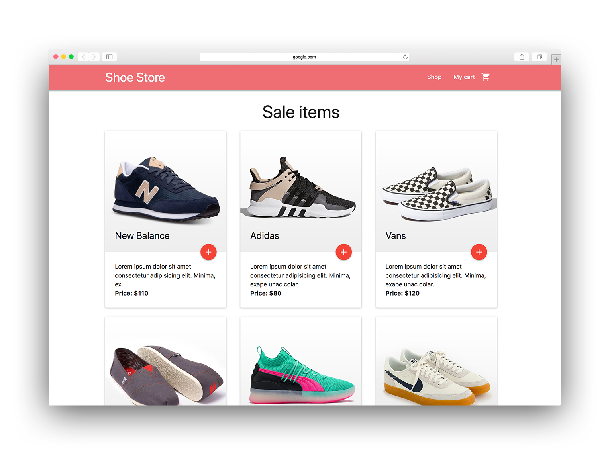

# Simple shopping cart app built with React & Redux

Shopping cart tutorial by AyaBellazreg. I learned how to build a simple e-commerce app using React and Redux. The app is styled using the Materialize CSS framework.

## Features

- Add and remove items from the shopping cart
- Edit the quantity of items in the cart
- Add shipping to the cart total

## Running Instructions

1. Click on "Clone or Download" on this repository page to download .zip file.
2. Open the root folder of the repository in terminal.
3. Run `npm install` in terminal to install the dependencies.
4. Start a local server to run the app:
   - Run `npm start` in terminal.
   - This will start a local dev server on http://localhost:3000
